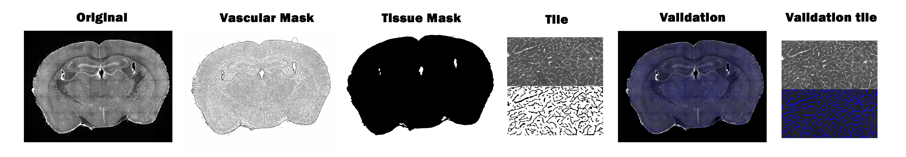
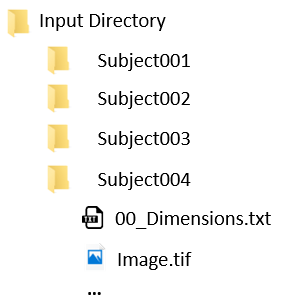
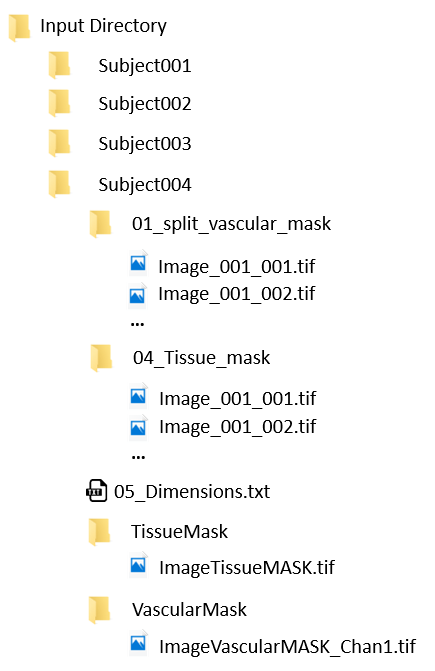
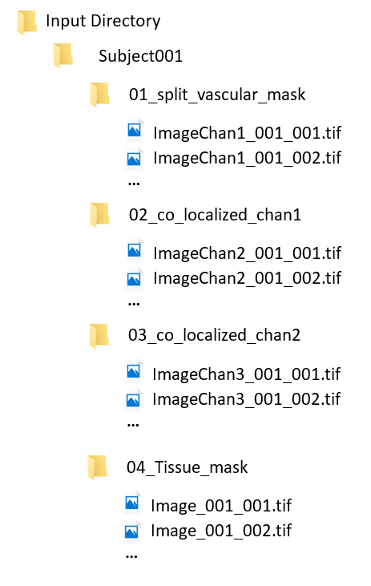
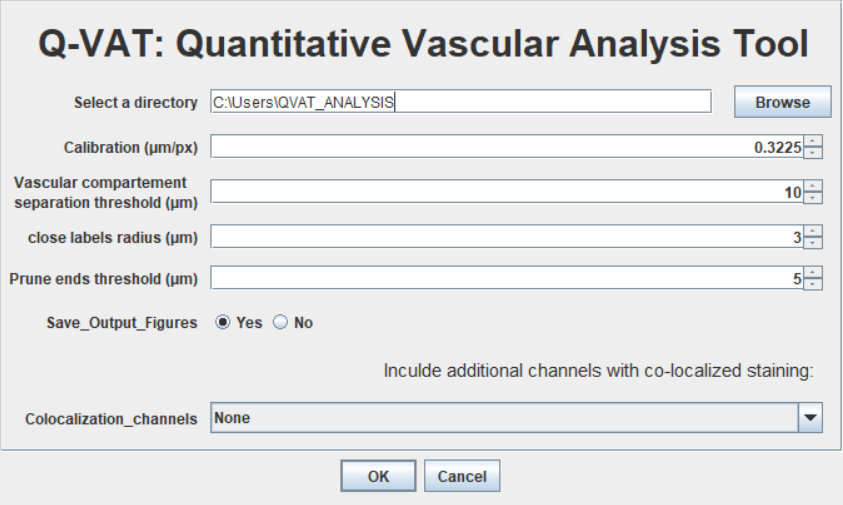
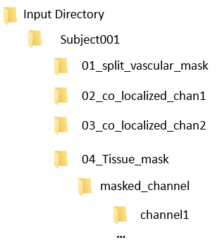

# **Quantitative Vascular Analysis Tool (Q-VAT)**

Q-VAT is an ImageJ macro to perform automated quantification of the vasculature in tiled, segmented two-dimensional images. Q-VAT is an easy to use tool that allows the user to automatically analyze and quantify the vascular network of large datasets in a tile-wise manner. Q-VAT was originally developed to analyze and quantify the vascular network the immuno-stained microscopy images of large samples, but can be used to quantify the vasculature in any type of segmentend 2D images.

We have included a pre-processing pipeline, the Q-VAT masking tool, that can be used to generate tiled, segmented 2D images from immuno-stained images of large samples. 

## **Requirements:**

Before using the Q-VAT you should install the following plugins: 

- FIJI is Just ImageJ. Download instructions: https://imagej.net/Fiji/Downloads
- BioVoxxel Toolbox. Installation: https://imagej.net/plugins/biovoxxel-toolbox
- Read and Write Excell. Installation: https://imagej.net/plugins/read-and-write-excel
- 3D ImageJ Suite. Installation: https://imagej.net/plugins/3d-imagej-suite/
- [Prune_Skeleton_Ends.bsh](https://gist.github.com/lacan/0a12113b1497db86d7df3ef102efd34d#file-prune_skeleton_ends-bsh)
Download and Unzip the Prune_Skeleton_Ends.bsh file and copy it into the FIji plugins folder (e.g. \fiji-win64\Fiji.app\plugins). Then,  restart ImageJ. 

## **Pre-processing: Q-VAT masking Tool**

The Q-VAT masking Tool uses a succession of several ImageJ commands to automatically create a vascular mask and tissue mask from stitched immuno-stained images. The generation of these masks consist of two parts First, the input image is used to create a Tissue mask. Next, the input images and the Tissue mask are used to create a vascular mask containing only the vasculature. Both masks are saved as whole images and as separate tiles that can be analyzed using the Q-VAT tool. 

### **File organization:**

The Q-VAT masking tool requires a fixed file organisation. The Q-VAT maksing tool will automatically loop over the different subfolders and load the correct files. It is therefore important to maintain a fixed order of the files. The exact naming of the file is not important. Within the input directory there should be a sub-directory for each sample that you want to processed. Each of these subdirectories (e.g. subj001) should have the following files: 

- Dimension file (.txt): **The first file in the folder** should be a .txt file that contain (you can assure that this is always the first file by adding "00_" in front of the filename). 

   - Width of the tiles you want to analyse (px).
   - Height of the tiles in pixels you want to analyse (px).
   - Percentage overlap that has been used to acquire the tiles (%).

        This is important if you want to split the original image into the original acquisition tiles removing the overlapping parts (Q-VAT masking tool assumes Down&Ritght stitching). Use 0 if no overlap was used or if you want to split the original images in tiles with a fixed size.
        
        Example: 00_dimensions.txt
    
           2048
           2044
           7

- Single channel stitched High resolution (immuno-stained) images. One image if you want to analyse only a single channel. Two or three images if you want to analyse one or two co-localized channels. The main channels should always be the first image file in the folder (e.g. image_Chan1.tif, image_Chan2.tif, image_Chan3.tif). 

### **Input Parameters:**

- **Input Directory:** Data directory containing sub-directories for each sample.
- **Pixel Calibration (µm/px):** calibration of the pixels in the original image.
- **Radius of the biggest object (µm):** Estimate of the radius of the biggest object in the original image (used as biggest feauture diameter for the rolling ball method in during the Convoluted backgroud substraction)
- **Particle size lower range (µm²):** Minimum area of particles that should be included in the tissue mask (Analyze particles).
- **Radius for median filtering (µm):** Radius that is used for median filtering.
- **File extension:** File extension of the original images.

### **Graphical User Interface:**

### **Output Parameters:**

The Q-VAT masking tool will automatically generate the following sub-directories/files within each sample folder:

- **01_split_vascular_mask:** Sub-directory that contains tiles with the segmented vasculature obtained by dividing the vascular mask into smaller tiles (.tif).
- [**02_co_localized_chan1:**  Sub-directory that contains tiles with the segmented vasculature of the first co-localized channel (.tif). ]
- [**03_col_localized_chan2:** Sub-directory that contains tiles with the segmented vasculature of the second co-localized channel (.tif).]
- **04_Tissue_mask:** Sub-directory that contains the segmented tissue mask obtained by dividing the tissue mask into tiles (.tif).
- **05_dimensions.txt:** text file with the tile dimensions used to generate the smaller tiles (.txt).
- **TissueMask:** Sub-directory that contains the Tissue mask as a whole image with the same dimensions as the original image.
- **VascularMask:** Sub-directory that contains the segmented vascular mask as a whole image with the same dimensions as the original image.
 

## **Q-VAT**

The Q-VAT Imagej macro loops over the provided tiles for each sample and uses a succession of ImageJ commands to calculate morpholigcal read-outs that characterize the vascular network within each tile. The obtained morphological read-outs are normalized to the tissue area and saved into an Excel file (.xls) file that can be used for statistical analysis. The Q-VAT tool is entirely automated and requires no user intervention during the analysis.

### **File organization:**

Q-VAT requires a fixed order of the files (the exact naming is not important).When the pre-processing is performed using the Q-VAT Masking Tool, the files will be automatically saved according to the required file organization. Within the input directory there should be a sub-directory for each sample that you want to processed. Each of these subdirectories (e.g. subj001) should have the following sub-directories: 

- The **first Sub-directory** should contain the tiles with the segemented vasculauture (.tif).
- [When analyzing a single co-localized channel: Sub-directory with the segmented vasculature tiles of the first co-localized channel (.tif). ]
- [When analyzing two co-localized channels: Sub-directory with the segmented vasculature tiles of the second co-localized channel (.tif). ]
- The **first sub-directory after the sub-directories with the segmented vasculature** should contain the tiles with the segmented tissue area (used for normalization). This will be the second sub-directory if only a single channel is analyzed.

The tiles should be saved as filename_00X_00Y with X = Column number and Y = Row number(e.g. Image_Chan1_001_008.tif). 

**Note**: Background pixel intensity values should be set to 0 (i.e. background in the tissue mask,  extravascular space in the segmented vascular mask). 

### **Input Parameters:**

To run Q-VAT you need to provide data directory and several input parameters in the GUI and press OK. 

- **Input directory:** Data directory containing sub-directories for each sample.
- **Pixel calibration (µm/px):** Calibration of the pixels in the original image.
- **Vascular compartment separation threshold (µm):** Threshold to split the vasculure in two compartements based on the mean branch diameter.
- **Close label radius (µm):** Used to fill small holes in the vascular mask with a diameter below the Close label radius.
- **Prune ends threshold (µm):** Used to prune endpoint branches with a length below the prune ends threshold. 
- **Save_Output_Figures (Yes/No):** Allows the user to choose whether or not to save the output figures.
- **Colocalization_channels (None, Channel2, Channel 2 &3):** Select how many co-localized channels your data set contains

### **Graphical User Interface:**

### **Output Parameters:**

Q-VAT will automaticallly generate and Excel file (filename_vascular_density.xls) that contains the normalized morphological read-outs for each tile. a sub-directory (\masked_file) will be created inside the directory that contains the tiles with the segmented tissue mask. Inside this directory a sub-directory will be created for each channel (e.g. \masked_file\channel1). This folder contains the output figures for each tile (.tif), the tile-wise maps and their colorbars (.tif) (if you selected to save the output figures) and the Excell file with the morphological read-outs. 
 
 
 
 

##  **How to cite:**

If using Q-VAT, please cite: (link paper)

## **References**

references to other plugins??
